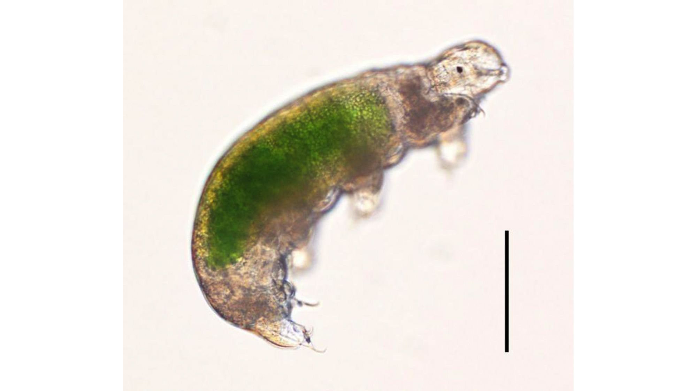

# 517-kinsey-tardigrades   

 Practice for ENG 517 (Assignment #1)

## Tardigrades
Tardigrades are really interesting microscopic animals that have captured the attention of today's animal and science enthusiasts! So much so that they are the star of their own episode of "Wild Krats", which you can watch [here][wildkratz link]. Tardigrades are also being studied for their ability to live in space! You can read about this research [with this link][tardigrades in space]. 

### Appearance
Here I will lay out some notable features of the Tardigrades appearance in order of most to least interesting (according to me, a Tardigrade "expert")

1. Their multiple chubby legs
1. Their little claws on said legs
1. They have wrinkly sections down their bodies
1. Their weird mouths

### Fun Facts

I hope you enjoyed that picture of a Tardigrade! Pretty cool, huh? Well buckle in, because you're in for some more coolness. Here below is an unordered list of cool Tardigrade facts!
* They are extremophiles, meaning they manage just fine in extreme climates (like space or volcanoes).
* They are omnivores, so they eat both plant matter and other animals (microscopic ones, of course)
* You can see real-life Tardigrades at the North Carolina Museum of Natural Sciences in Raleigh, where I work on Saturdays! Tardigrades are located in the 3rd floor of the NRC building in the Micro-World Investgate Lab. Come see us and the Tardigrades!

[wildkratz link]: https://www.youtube.com/watch?v=NhsuzqZOiKQ
[tardigrades in space]: https://www.nasa.gov/podcasts/houston-we-have-a-podcast/water-bears-in-space/